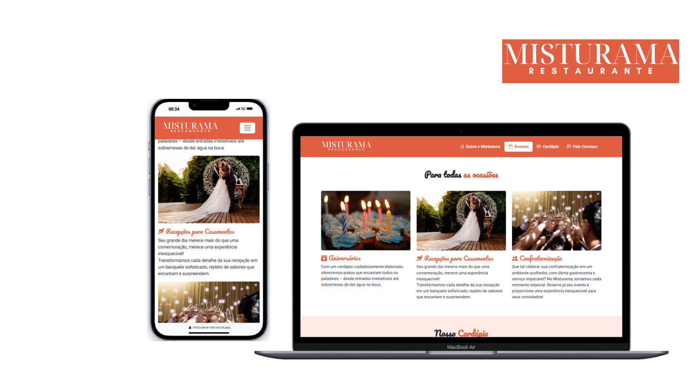

<h1 align="center">Site do Restaurante Misturama</h1>

  <a href="#-tecnologias">Tecnologias</a>&nbsp;&nbsp;&nbsp;|&nbsp;&nbsp;&nbsp;
  <a href="#-projeto">Projeto</a>&nbsp;&nbsp;&nbsp;

 

  

## 🚀 Tecnologias

Esse projeto foi desenvolvido com as seguintes tecnologias:

- HTML, CSS & BOOTSTRAP
- Git e Github

## 💻 Projeto

Este é o meu mais recente trabalho.
PROJETO CONSTRUIDO PARA O CURSO DE DESENVOLVEDOR FULL STACK PYTHON DA EBAC.

- [Acesse o projeto finalizado, online]([(https://misturama-site.vercel.app.])
